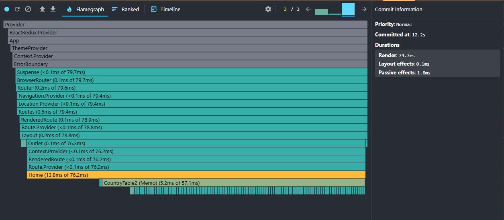
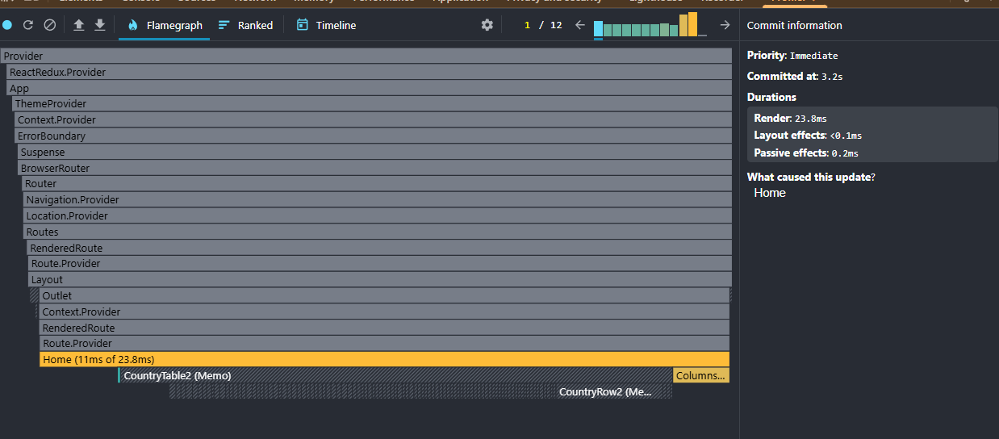
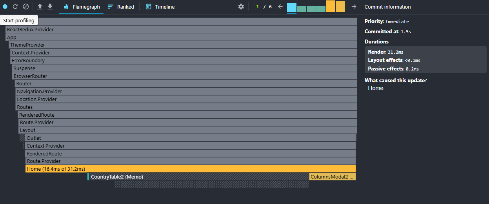
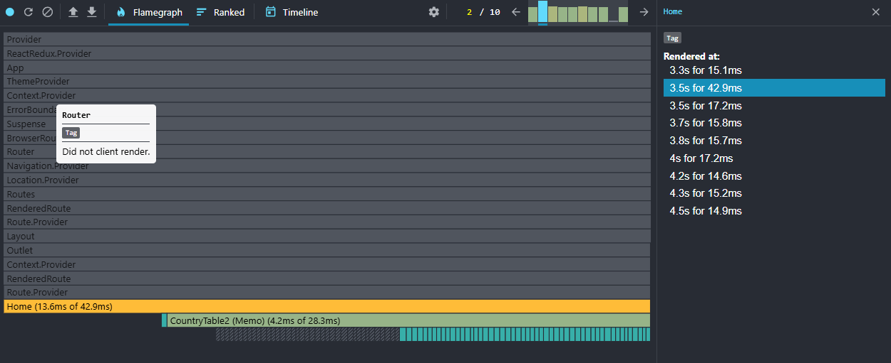
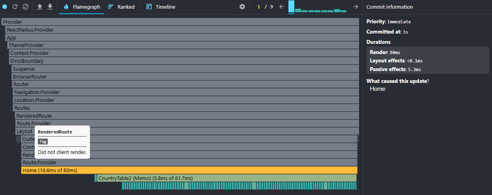
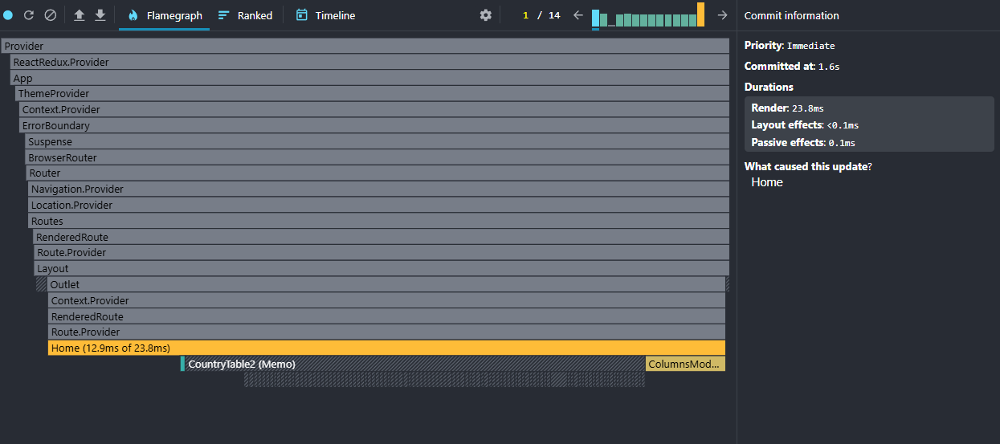

## CO2 Explorer (React Performance Task)

Implementation of the RS School React Performance assignment. The app loads a large OWID CO2 dataset with Suspense and provides filtering, sorting, and extra columns with attention to performance.

### Features mapped to task
- Data loading via React Suspense with fallback UI.
- Countries list with latest values and per-country expandable yearly table.
- Required yearly columns: year, population, co2, co2_per_capita (N/A for missing).
- Modal to select additional columns from available yearly fields.
- Controls: Year selector (with brief highlight on change), Region filter, Search, Sort (name, population, CO2, CO2 per capita).
- Memoization: useMemo for derived data, React.memo for tables/rows, useCallback for handlers.
- Virtualized yearly table rendering.

### Score checklist (self-check)
- [x] Fetch and display country data (name, latest population, ISO)
- [x] Yearly table with required columns (N/A for missing)
- [x] Modal for extra columns
- [x] Year selector with highlight when values change
- [x] Filter by region
- [x] Search by country name
- [x] Sort by population (selected year) and name (asc/desc)
- [x] useMemo/useCallback/React.memo applied
- [x] Suspense fallback UI in place

### Getting started
1) Install dependencies
	- `npm install`
2) Run dev server
	- `npm run dev`
3) Lint
	- `npm run lint`

### Profiling notes
See `performance/README-PERF.md` for the detailed guide. Summary and baseline screenshots below.

#### Baseline profiling (before optimizations)
Captured with React DevTools Profiler (one session per interaction):
- Initial mount: 
- Sort by name: 
- Sort by CO2: 
- Search: 
- Year change: 
- Columns toggle: 

Each interaction also has a Ranked view (see the baseline folder).

#### After profiling (after optimizations)
To be captured and added in `./performance/docs/perf/after/` with the same scenarios. A brief summary will be appended here after capture.

### Tech
- Vite + React + TypeScript (strict)
- Redux Toolkit for filters/columns selection
- Tailwind for styling (no component libraries)
