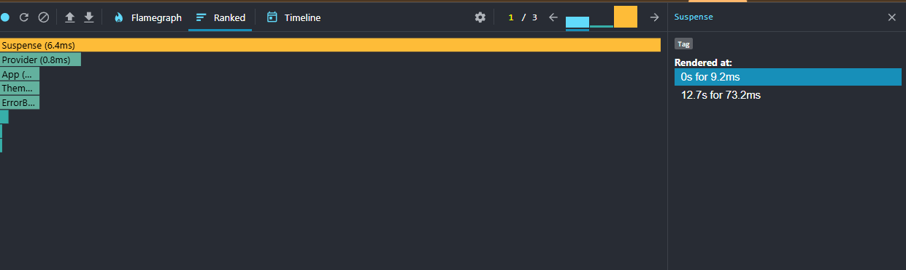
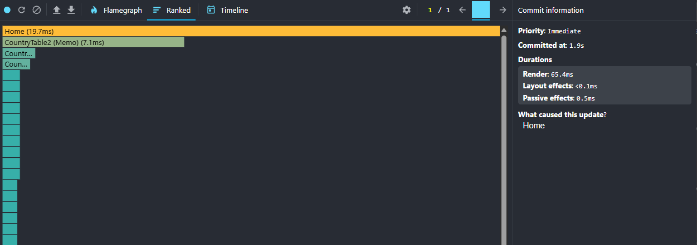
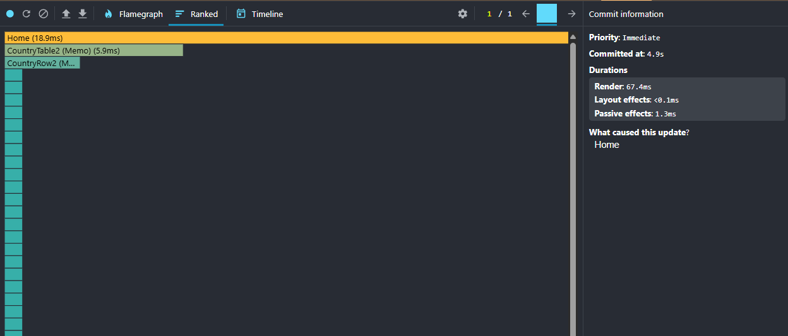
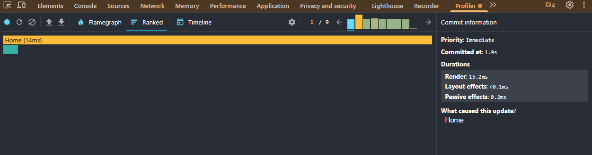
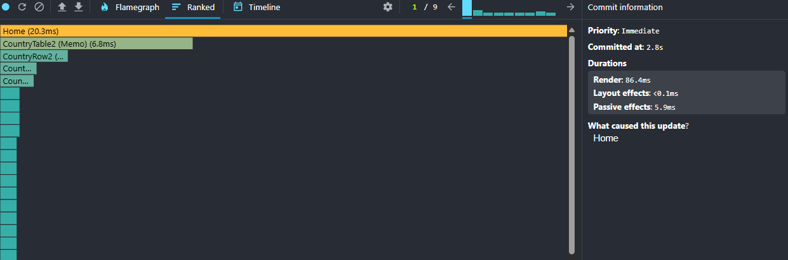
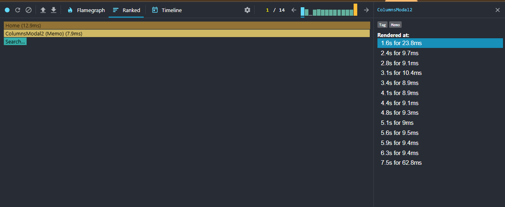

# CO2 Explorer — Performance Notes

This document tracks profiling and optimization steps. Replace TODOs with screenshots and metrics from your machine.

## Baseline profile (before optimizations)

Follow these steps for each interaction; save screenshots in `../docs/perf/baseline/`.

0. Initial mount (full page render)

- Why: capture first render cost (Suspense fallback → data resolved → table shown).
- Steps:
  1.  Open DevTools → Network, enable "Disable cache".
  2.  Open React DevTools → Profiler.
  3.  Click the circular arrow "Reload and profile" button in Profiler toolbar.
  4.  Wait for the page to fully render the table; stop automatically when ready.
- Capture: Commit(s) for mount, Flamegraph, Ranked.
- Screenshot(s):
  - Flamegraph: 
  - Ranked: 
- Notes: TODO — list commit durations and biggest contributors.

1. Sorting a column

- Steps: Start profiling → change Sort (e.g., name asc→desc) → Stop profiling
- Capture: Commit time summary, Flamegraph, Ranked, Interactions
- Screenshots:
  - Name: 
    - Ranked: 
  - CO2: 
    - Ranked: 
- Notes: TODO — describe commit duration, top renderers

2. Searching a country

- Steps: Start profiling → focus search → type 3–5 letters (e.g., “can”) → Stop
- Screenshots:
  - Flamegraph: 
  - Ranked: 
- Notes: TODO — debounce impact, list renders

3. Selecting another year

- Steps: Start profiling → choose year (e.g., 2000 → 2010) → Stop
- Screenshots:
  - Flamegraph: 
  - Ranked: 
- Notes: TODO — highlight effect cost minimal; table recomputation cost

4. Adding/removing columns

- Steps: Start profiling → open modal → tick 2–3 columns → Apply → Stop
- Screenshots:
  - Flamegraph: 
  - Ranked: 
- Notes: TODO — column mapping cost; memo effectiveness

## Optimizations applied

- Derived data memoization in `useCo2Data`.
- Row memoization: `CountryRow` and `CountryTable` wrapped with `React.memo`.
- Stable handlers via `useCallback` in `Home`.
- Virtualization in `YearlyTable` (windowed rendering).
- Modal and table container memoized.

## After profile

- TODO: Insert screenshots and compare commit times/renders vs baseline.

Suggested file names in `../docs/perf/after/`:

- `mount.png`, `sort.png`, `search.png`, `year.png`, `columns.png`

## Findings

- TODO: Brief bullet list of what helped most.

Template:

- Memoized derived list reduced CountryTable commits by X%.
- Virtualized YearlyTable cut row renders from N to ~V.
- Stable handlers eliminated re-renders of children on control changes.

## Next ideas

- Consider react-window for outer list if dataset grows.
- Consider web worker parsing if JSON grows beyond current size.
